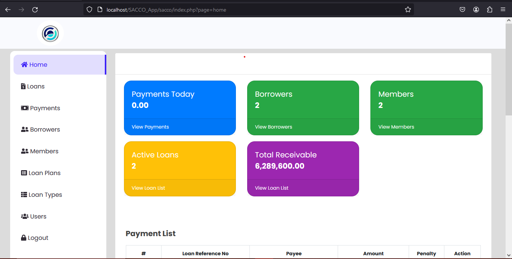

```css
 SACCO Application
```

## Overview

The SACCO Application is a web-based system designed to manage Savings and Credit Cooperative Organizations efficiently. This application includes features for managing borrowers, loans, and user accounts, including admins, staff, and members.

## Features

- User Management: Admins can manage user accounts, including different user roles (Admin, Staff, Member).
- Borrower Management: Add, edit, and delete borrower information.
- Loan Management: Apply for loans, calculate loan details, and manage loan statuses.
- Profile Management: Members can upload profile pictures and identification documents.

## Technologies Used

- PHP
- MySQL
- JavaScript (jQuery, Ajax)
- HTML/CSS (Bootstrap)
- CodeIgniter (PHP framework)

## Installation

### Prerequisites

- Web server (Apache, Nginx, etc.)
- PHP (>=7.4)
- MySQL or MariaDB
- Composer (for PHP package management)

```css
cd sacco-app
```
## Install Dependancies
```css
composer install
```
Usage
User Management

    Admin Dashboard:
        Navigate to the admin dashboard to manage users, borrowers, and loans.
        Admins can add new users, edit user details, and assign roles.

    Borrower Management:
        Add new borrowers through the borrower management interface.
        Edit borrower details as necessary.

    Loan Management:
        Apply for new loans.
        Calculate loan repayment details using the provided calculator.
        Manage loan statuses (For Approval, Approved, Released, Complete, Denied).

Member Profile Management

    Members can upload profile pictures and identification documents.
    Admins can verify and manage these documents.

## Here is a sample screenshot.


